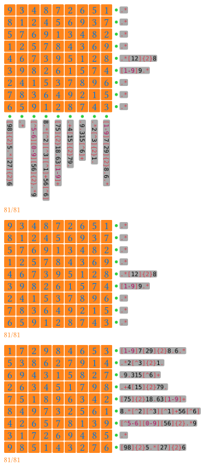

# crossregex-typ

A crossword-like game written in Typst. You should fill in letters to satisfy regular expression constraints.
Currently, _squares_ and _regular hexagons_ are supported.

> [!note]
> This is not a puzzle solver, but a puzzle layout builder.

It takes inspiration from a web image, which derives our standard example. **I'm not the original author.**


## Examples

Code can be found in `./examples`

### Sudoku

Derives from <https://regexcrossword.com/playerpuzzles/65bbe21e88914>.



### Mini hex


### Standard hex


## Appearance

### Cells

The cells can be customized.
For squares, the default is

```typst
#polygon.regular(size: calc.sqrt(2) * 1em, vertices: 4, stroke: 0.5pt)
```

For hexagons, the default is

```typst
#rotate(30deg, polygon.regular(size: 2em, vertices: 6, stroke: 0.5pt), origin: center)
```

### Constraint hints

In front of each regex constraint text, we have a circle in red, yellow or green. It has the following meaning:

- $\color{red}\text{Red}$: This constraint is not satisfied.
- $\color{yellow}\text{Yellow}$: This constraint is satisfied, but unfilled cells exist.
- $\color{green}\text{Green}$: This constraint is satisfied.

You can change this default behavior by passing a custom `deco-config.hint-marker`.

The regex box can also be customized by the `deco-config.regex-style` function. The default function is

```typst
#box.with(fill: gray.transparentize(90%), outset: (x: 0.1em, y: 0.2em), radius: 0.2em)
```

We use a wasm plugin to check regex matching, which employs the [`fancy-regex`](https://docs.rs/fancy-regex/latest/fancy_regex/) crate to bring more features than `regex` used by Typst provided. You can refer to its doc to learn about supported syntax. Note that `\d` is not supported. Please use `[0-9]` directly instead.

### Filled letters

In the grids, upper-case letters are colored $\color{blue}\text{blue}$, while others are colored $\color{purple}\text{purple}$. So you can use lower-case letters or symbols as hints.

This default behavior can also be changed by a custom `cell-config`.

### Counting

If you provide answers, it will show the number of filled and total cells at bottom left.

You can provide a custom creator function `progress-creator`, whose default is

```typst
#(filled, total) => text(orange)[#filled/#total]
```

You can turn of the progress by a `none` value.

## Basic Usage

```typst
#import "@preview/crossregex:0.2.0": crossregex

#crossregex(
  3,
  constraints: (
    `A.*`, `B.*`, `C.*`, `D.*`, `E.*`,
    `F.*`, `G.*`, `H.*`, `I.*`, `J.*`,
    `K.*`, `L.*`, `M.*`, `N.*`, `O.*`,
  ),
  answer: (
    "ABC",
    "DEFG",
    "HIJKL",
    "MNOP",
    "QRS",
  ),
)
```

## Document

See the doc comments above the `crossregex` function in `lib.typ`.

You can choose to turn off some views.

Feel free to open issues if any problems.

## Changelog

### 0.2.0

- Feature: Supports square shapes.
- Feature: Supports customization the appearance of everything, even the cells.
- Feature: Supports custom alphabets.
- Fix: An mistake related to import in the README example.

### 0.1.0

First release with basic hex features.
