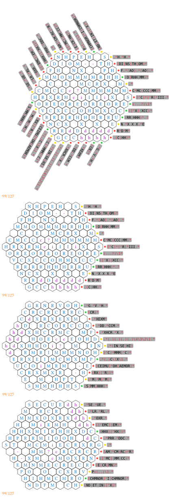

# crossregex-typ

A crossword-like game written in Typst. You should fill letters to satisfy regular expression constraints.

It takes inspiration from a web image, which derives our standard example. **I'm not the original author.**


## Examples

Code can be found in `./examples`




## Notations

### Constraint hints

In front of each regex constraint text, we have a circle in red, yellow or green. It has the following meaning:

- $\color{red}\text{Red}$: This constraint is not satisfied.
- $\color{yellow}\text{Yellow}$: This constraint is satisfied, but unfilled cells exist.
- $\color{green}\text{Green}$: This constraint is satisfied.

We use a wasm plugin to check matching.

### Filled letters

In the hex grids, upper-case letters are colored $\color{blue}\text{blue}$, while others are colored $\color{purple}\text{purple}$. So you can use lower-case letters or symbols as hints.

### Counting

If you provide answers, it will show the number of filled and total cells at bottom left.

## Basic Usage

```typst
#import "@preview/crossregex:0.1.0"

#crossregex(
  1,
  constraints: (
    `.*`,
  ),
  answer: (
    " ",
  )
)
```

## Document

See the doc comments above the `crossregex` function in `crossregex.typ`.

You can choose to turn off some views.
